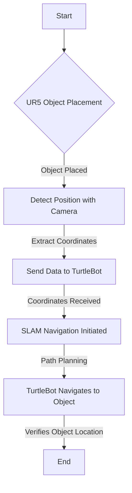
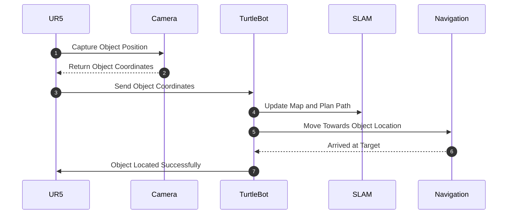

## **Flowchart: Project Workflow**

```mermaid
graph TD
  A[Start] --> B{UR5 Object Placement};
  B -->|Object Placed| C[Detect Position with Camera];
  C -->|Extract Coordinates| D[Send Data to TurtleBot];
  D -->|Coordinates Received| E[SLAM Navigation Initiated];
  E -->|Path Planning| F[TurtleBot Navigates to Object];
  F -->|Verifies Object Location| G[End];
```

## **Sequence Diagram: Communication Between UR5 and TurtleBot**

```mermaid
sequenceDiagram
autonumber
participant UR5
participant Camera
participant TurtleBot

UR5->>Camera: Capture Object Position
Camera-->>UR5: Return Object Coordinates
UR5->>TurtleBot: Send Object Coordinates
TurtleBot->>SLAM: Update Map and Plan Path
TurtleBot->>Navigation: Move Towards Object Location
Navigation-->>TurtleBot: Arrived at Target
TurtleBot->>UR5: Object Located Successfully
```
