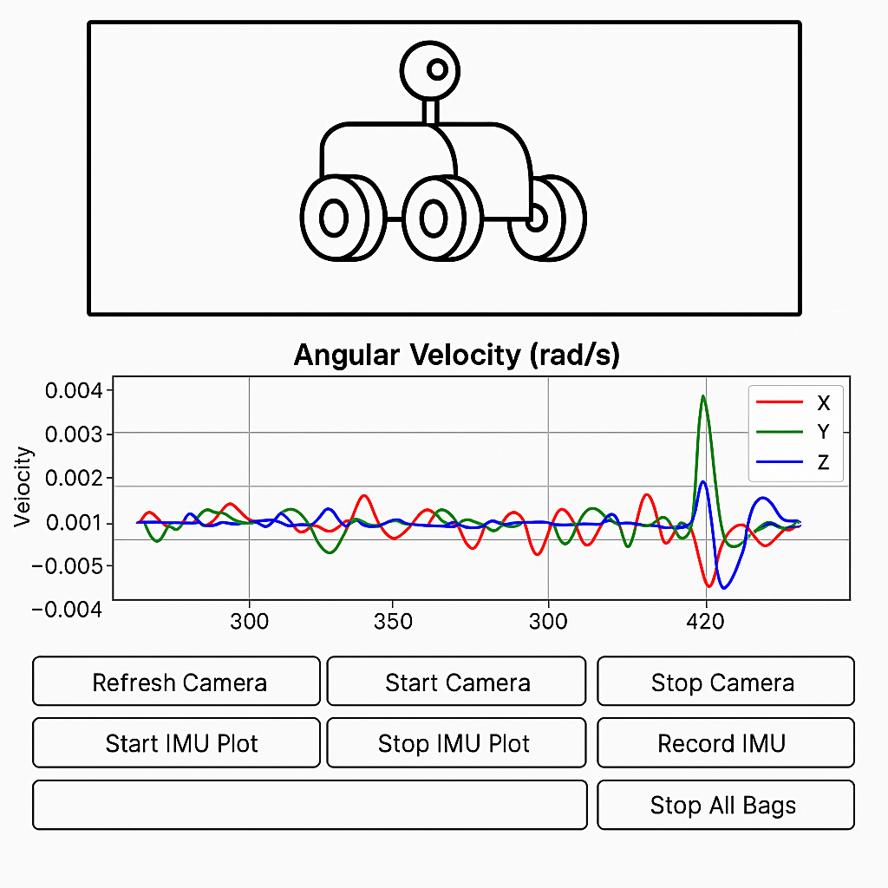

# Coordinated Autonomy: Goal-Oriented Navigation with TurtleBot and ESP32

## **About Us**

- **Team Number**: 05  
- **Team Members**: Asrith Pandreka, Varun Karthik, Anjali Notani  
- **Semester and Year**: Spring 2025  
- **University**: Arizona State University  
- **Class**: RAS598 Experimentation and Deployment of Robotics  
- **Advising Faculty**: Dr. Daniel Aukes  

## **1. Introduction**

### **Project Scope**

Our current project focuses on enabling autonomous navigation and control for a TurtleBot 4 using integrated sensor data and remote coordination. It centers around mobile robot navigation in indoor environments using a combination of real-time data and remote commands.

The system integrates a TurtleBot equipped with LiDAR, IMU, and a camera, communicating with a Raspberry Pi running ROS2. Additionally, an ESP32 microcontroller equipped with an IMU is used to send goal coordinates wirelessly to the Raspberry Pi. Based on this input and onboard sensor data, the Raspberry Pi processes information for mapping, control, path planning, and navigation.

The revised core research question is:  
**"How can sensor fusion and real-time feedback be used to enable autonomous indoor navigation of a mobile robot based on external goal coordinates?"**

This project investigates how autonomous systems can utilize ROS2 to process multi-sensor inputs for effective localization, navigation, and decision-making. It emphasizes integrating low-cost microcontrollers, real-time feedback loops, and live data visualization to enhance autonomy.

### **Project Architecture Diagram**

## **2. Hardware and Software Requirements**

### **Hardware Components**

**TurtleBot 4**  
Equipped with LiDAR, IMU, and a camera, TurtleBot serves as the core mobile platform. It operates on a Raspberry Pi, running ROS2 to support real-time sensor-based navigation and control.

**ESP32 Microcontroller with IMU**  
Sends goal coordinates and orientation data wirelessly to the Raspberry Pi. The onboard IMU captures heading and motion, aiding remote coordination.

**Compute System**  
Raspberry Pi 4 on TurtleBot runs ROS2 and processes all sensor data for decision-making.

**Communication**  
Data is exchanged between ESP32 and Raspberry Pi via ROS2 topics.

### **Interface Mockup**

### **Software Components**

- **Operating System**: Ubuntu 22.04  
- **Robotics Framework**: ROS2 (Humble)  
- **Visualization Tools**: RViz2, rqt, custom GUI (PyQt or similar)  
- **SLAM & Navigation**:  
  - SLAM Toolbox for mapping  
  - Nav2 Stack for path planning and obstacle avoidance  
- **Filtering**:  
  - Low-pass filter applied to ESP32 IMU data before fusion or visualization  
- **Custom ROS2 Nodes**:  
  - Node to receive and parse ESP32 coordinates  
  - Sensor data publishers for LiDAR, camera, and IMU  
  - Navigation and control node for goal-directed movement  
  - GUI node for live data visualization  

## **3. Sensor Integration and Interaction**

| Sensor            | Function                                                      |
|-------------------|---------------------------------------------------------------|
| ESP32 IMU         | Sends orientation and goal coordinates to Raspberry Pi        |
| TurtleBot Camera  | Assists in obstacle detection and path planning               |
| LiDAR             | Provides real-time mapping and obstacle detection             |
| TurtleBot IMU     | Supplies orientation and stability information for navigation |

> *A low-pass filter is applied to the ESP32’s IMU data to eliminate high-frequency noise and improve heading stability!*

## **4. Control Flow and Autonomy**

### **ESP32 → Raspberry Pi**

The ESP32 periodically sends goal coordinates and IMU orientation data to the Raspberry Pi wirelessly.

### **Sensor Processing on Raspberry Pi**

Camera, IMU, and LiDAR data are collected via ROS2 topics. The Raspberry Pi fuses these inputs for localization and mapping.

### **Autonomous Control**

- SLAM Toolbox constructs a real-time map of the environment.  
- Nav2 performs path planning and sends movement commands.  
- GUI provides real-time feedback of sensor inputs and robot status.  

## **5. Preparation Needs**

- **ROS2 Environment Setup**  
  - Installation of ROS2 Humble on Ubuntu  
  - Configuration of ROS2 workspaces for TurtleBot  

- **Hardware Testing**  
  - Calibration of the external camera and LiDAR  
  - Testing TurtleBot navigation  

- **Software Development**  
  - Writing ROS2 nodes for communication  
  - Implementing object detection using OpenCV  

- **Simulation Setup**  
  - Running Rviz simulations before physical implementation  

## **6. Final Demonstration Plan**

### **Setup**

The TurtleBot starts in an indoor setting with predefined obstacles. ESP32 sends a target coordinate and heading to the Raspberry Pi.

### **Execution**

The Raspberry Pi receives the goal, maps the space using SLAM, and generates a safe path using Nav2. The TurtleBot autonomously navigates to the goal while displaying real-time sensor data and localization in the GUI.

### **Evaluation Metrics**

- Goal-reaching accuracy  
- Map construction quality  
- Obstacle avoidance efficiency  
- GUI visualization and latency  

## **7. Testing and Evaluation Plan**

### **1. Unit Testing**

- ESP32 IMU data transmission  
- Sensor topic publishing in ROS2  
- Nav2 local planner  

### **2. Integration Testing**

- Full path planning using live sensor data  
- Real-time response to goal changes  

### **3. Error Handling**

- Dropout handling for ESP32 messages  
- Navigation recovery from collision or missed goals  

### **4. Performance Metrics**

- Distance error to target  
- Time taken for goal completion  
- Obstacle handling success rate  

## **8. Project Impact**

This project demonstrates how low-cost autonomous robots can be enhanced through ROS2-based sensor fusion and decentralized coordination using microcontrollers. It provides a foundation for assistive or service robots in indoor navigation tasks, with potential applications in elderly assistance, warehouse automation, and academic robotics education.

## **9. Advising and Resource Needs**

**Advisor:** Prof. Daniel M Aukes  

Prof. Daniel M Aukes, an esteemed faculty member with deep expertise in SLAM (Simultaneous Localization and Mapping) and multi-robot coordination, will serve as the primary advisor for this project. Prof. Aukes brings a wealth of experience in robotic systems design and implementation, which will be invaluable for guiding the technical development and integration aspects of our project. His prior work, focusing on the application of innovative robotics solutions in real-world scenarios, will provide critical insights into our design and execution phases.

Prof. Aukes will also assist in troubleshooting complex system integration issues. Additionally, he will provide access to laboratory resources and equipment, facilitate networking with other robotics experts, and help in acquiring necessary project funding. His mentorship will be crucial in steering the project towards successful completion and ensuring that the team remains aligned with the latest advancements in robotics technology.
